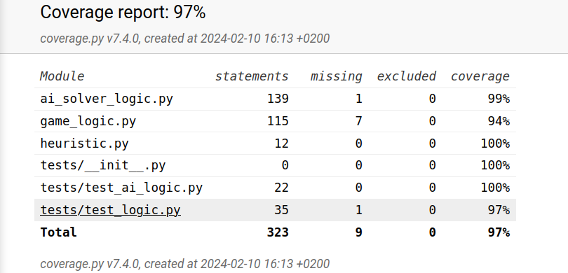

# Testing Document
### ExpectMMAI Class
1. test_take_turn_detects_movement

    Input: Board with two adjacent tiles.
    Action: Call take_turn method with "LEFT" direction.
    Expected: Method should detect and merge tiles to the left.

2. test_best_move_EMM

    Input: Board with tiles of different values.
    Action: Call best_move_EMM method with depth 2.
    Expected: Method should choose "DOWN" as the best move.

### Logic Class
1. test_take_turn_up

    Input: Board with mergeable tiles moving up.
    Action: Call take_turn method with "UP" direction.
    Expected: Tiles should merge correctly, and score updates.

2. test_take_turn_down

    Input: Board with mergeable tiles moving down.
    Action: Call take_turn method with "DOWN" direction.
    Expected: Tiles should merge correctly, and score updates.

3. test_take_turn_left

    Input: Board with mergeable tiles moving left.
    Action: Call take_turn method with "LEFT" direction.
    Expected: Tiles should merge correctly, and score updates.

4. test_take_turn_right

    Input: Board with mergeable tiles moving right.
    Action: Call take_turn method with "RIGHT" direction.
    Expected: Tiles should merge correctly, and score updates.

5. test_new_pieces

    Input: Board with empty spots.
    Action: Call new_pieces method.
    Expected: Generates a new tile in an empty spot, moves_possible is True.

### Test coverage

* 

#### Conclusion

All tests passed successfully, demonstrating correct functionality for both classes.